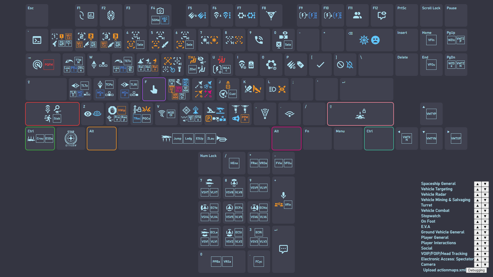

# Star Citizen Keybinding Visualizer

A WIP react app that visualizes the complicated action maps of Star Citizen with icons.

A preview for the current build. This is not the final design. Only showing the default keybindings. Squares with texts are placeholders for the actions that do not have an icon, and will be assigned with an icon in the future updates.

## Functionalities to be done

- [x] Showing available actions for each key on a standard keyboard.
- [ ] Showing available actions for each key on a mouse.
- [ ] Showing available actions for each key on a controller.
- [ ] Showing available actions for each key on a joystick.
- [x] Uploading actionmaps.xml and show user's customized keybindings.
- [ ] Allow user to change priorities of different action categories. 
  - [x] Basic functionalities
  - [ ] Better appearance
  - [ ] Drag & drop to a new position
  - [ ] Hide & show certain item
- [ ] Allow user to change order of modifiers. 
  - e.g. left alt > right alt > left ctrl > ...
- [ ] Saving user's setting and customized keybindings in local storage.
- [ ] Hovering (or clicking) on keys to show detailed action info.

## Icon sources

Most are original. Some of the icons are inspired by [icons from Star Citizen](https://robertsspaceindustries.com/pledge/ships/gladius/Gladius#holo-viewer) and [Material Design Icons](https://pictogrammers.com/library/mdi/), or modified from them (as part of the icon), or use them as the whole icon.

